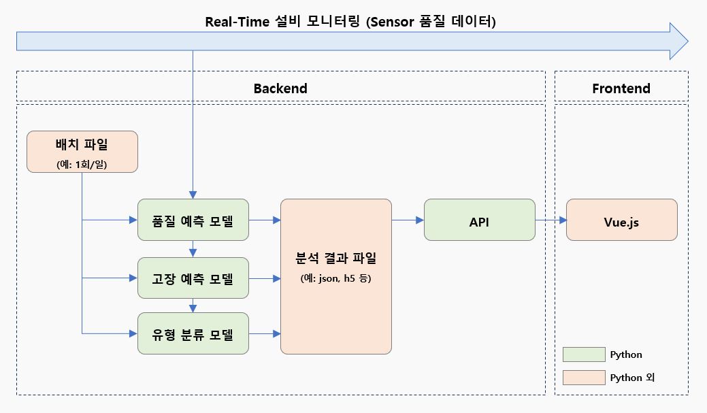

## SKKU-스마트팩토리응용프로그래밍 Term Project

본 프로젝트에서는 설비의 시계열 센서 데이터를 기반으로
① 미래 품질 예측 ② 고장 시점 예측 ③ 고장 유형 분류의 기능을 수행하는 대시보드를 구축하였습니다.

- 분석은 각 기능별로 분리된 .py 파일에서 수행
- 분석 결과는 .json 포맷으로 저장되어 main.py의 API를 통해 웹 상에 시각화
- 시연은 Backend 서버가 없는 관계로 localhost로 진행
  

Web Frontend는 Vue.js 기반으로 작성되었으며, 센서 데이터 시각화 및 사용자 요청 처리를 담당합니다.
※ Frontend 관련 설명은 Python 외 언어로 구성되어 있으므로 본 문서에서 생략

## 데이터 출처

- 분석 데이터는 [Kaggle](https://www.kaggle.com/datasets/nphantawee/pump-sensor-data/data)에서 취득
- 시계열 기반의 데이터로 날짜(timestamp): 2018-04-01 00:00:00 ~ 2018-08-31 23:59:00, 1분 단위​로 구성
- 51개의 센서 데이터로 sensor_00~sensor_51: 측정된 Data 값, float로 구성
- 설비 상태(NORMAL, BROKEN, RECOVERING) 정보 존재

## 데이터 가공

- 모든 값이 0 또는 NaN인 컬럼과 std < 1.2 미만인 변동성이 낮은 컬럼 제거
- timestamp를 인덱스로 설정하여 결측치에 대해 시간 기반 보간(interpolation) 수행
- 전체 데이터의 60%는 Train, 40%는 Test에 활용

## [미래 품질 예측](https://github.com/taekjun-lee/SKKU-SFP/blob/main/backend/qual.py)

※ [.ipynb 파일](https://github.com/taekjun-lee/SKKU-SFP/blob/main/backend/qual.ipynb)

- 화면 출력 결과는 위의 .ipynb에서 확인 (.py에서는 API 호출을 위해 결과를 .json으로 저장)

**1. 트렌드 예측용 Window 생성**

- 입력 시계열 길이 60 타임스텝, 예측 목표는 다음 시점 센서값
- 전체 센서 데이터를 기준으로 학습(60%), 테스트(40%) 데이터 분리

**2. 비교 모델 학습 및 평가**

- 주요 시계열 예측 모델 6종에 대해 학습 수행 (10% 샘플 사용, 비교 목적)
- GRU, LSTM, BiLSTM, 1D-CNN, TCN, Transformer
- 약식 평가 결과는 .json 형태로 Web에 제공 후 시각화

**3. 대표 모델(GRU, LSTM, BiLSTM) 전체 데이터 학습**

- MSE, MAE, R2 Score 산출 후 .json 형태로 Web에 제공 후 시각화
- 센서별 MSE를 산출하여 .json 형태로 Web에 제공 후 시각화
- 가장 우수한 GRU 모델의 개별 센서 예측 성능은 .json 형태로 Web에 제공 후 시각화

**4. GRU 기반 예측 결과 시각화 데이터 생성**

- 테스트 구간 이후 7일치 미래 데이터를 포함한 예측 결과 생성
- 예측된 시계열은 timestamp와 함께 정리되어 .json 형태로 Web에 제공 후 시각화
- 실제 관측값(테스트)과 미래 구간 예측값을 구분하여 .json 형태로 Web에 제공 후 시각화

**5. 한계점 및 개선사항**

- Test Data 내 60개의 데이터를 모델에서 입력 받은 후 61번째 값을 예측하여 해당 예측 값들로 구성된 차트를 생성
- Test 구간 이후의 입력을 모두 자체 예측값에 의존하여 생성했기 때문에 미래로 갈수록 오차가 누적되는 한계 존재
- KNN 기반의 유사 시계열 보정 기법을 적용하여 장기 예측의 안정성과 신뢰도를 향상

## [고장 시점 예측](https://github.com/taekjun-lee/SKKU-SFP/blob/main/backend/maint.py)

※ [.ipynb 파일](https://github.com/taekjun-lee/SKKU-SFP/blob/main/backend/maint.ipynb)

- 화면 출력 결과는 위의 .ipynb에서 확인 (.py에서는 API 호출을 위해 결과를 .json으로 저장)

**1. 상태 예측용 시계열 윈도우 생성**

- 센서 데이터로부터 60타임스텝 길이의 입력 구간을 생성
- 해당 구간 직후 시점의 설비 상태(machine_status_encoded)를 예측 대상으로 설정
- 전체 데이터 기준 60%를 학습용, 40%를 테스트용으로 분할하여 구성

**2. 다중 분류 모델 학습 및 평가**

- 총 4가지 알고리즘을 사용하여 상태 분류 모델 학습
- XGBoost (multi:softmax) / LightGBM (multiclass) / 1D-CNN (Convolution 기반 딥러닝 모델) / LSTM (순환신경망 기반 딥러닝 모델)
- 각각의 모델은 학습 후 BROKEN, RECOVERING, NORMAL에 대한 분류 정확도 및 F1-score 산출

**3. F1-score 기반 모델 성능 비교**

- 모델별 상태 클래스(NORMAL, RECOVERING, BROKEN)별 F1-score 비교
- 비교 결과는 .json 형태로 Web에 제공 후 시각화

**4. 상태 분류 시계열 예측**

- 테스트 구간에 대해 시점별 예측 결과를 실제 상태값과 함께 정리
- XGBoost, LightGBM, CNN, LSTM 각 모델의 예측 결과는 .json 형태로 Web에 제공 후 시각화

**5. RECOVERING 상태 구간 추출**

- 학습 및 예측 과정에서 나타난 RECOVERING 상태 시점 리스트를 추출
- 시계열 시각화에서 하이라이트 영역으로 활용

## [고장 유형 분류](https://github.com/taekjun-lee/SKKU-SFP/blob/main/backend/classify.py)

※ [.ipynb 파일](https://github.com/taekjun-lee/SKKU-SFP/blob/main/backend/classify.ipynb)

- 화면 출력 결과는 위의 .ipynb에서 확인 (.py에서는 API 호출을 위해 결과를 .json으로 저장)

**1. 고장 직전 구간 추출 (Pre-Failure Window)**

- 고장 시점(BROKEN)을 기준으로, 고장 직전 n=10개의 데이터를 window로 구성
- 총 7건의 고장 구간 중 학습용 5건, 테스트용 2건으로 분리

**2. 클러스터링 기반 고장 유형 분류**

- KMeans (2/3/4 클러스터) 및 Gaussian Mixture Model (GMM) (2/3/4 컴포넌트)
- 클러스터 결과를 train 데이터에 부여하여 고장 구간 유형 분류 수행

**3. 시각화를 위한 t-SNE 임베딩**

- 2차원 임베딩된 tsne_1, tsne_2 좌표 생성
- 각 클러스터 라벨과 함께 .json 형태로 저장 후 API를 통해 Web에서 시각화

**4. 클러스터 품질 평가**

- Silhouette Score, Davies-Bouldin Index(DBI)
- 평가 결과는 data/clustering_scores.json에 저장 후 API를 통해 Web에서 시각화

**5. 테스트 데이터의 이상 탐지**

- KMeans 클러스터 중심으로부터의 거리 기반 이상 판단
- 기존 학습된 KMeans(3개 클러스터)의 최소 거리 기준 threshold 설정 후 이를 초과하는 테스트 데이터는 이상으로 분류

## [예측 및 시각화 API(FastAPI)](https://github.com/taekjun-lee/SKKU-SFP/blob/main/backend/main.py)

**1. 센서 데이터 구조 파악용 API**

- /api/headers: 센서 및 수치형 컬럼 이름 조회
- /api/timestamp_example: timestamp 컬럼의 예시 5개
- /api/sensor_example: 센서 값 5행 샘플 조회 (2~9번째 컬럼)
- /api/status_example: 상태(machine_status)별 값 및 개수 조회

**2. 고장 분류 예측 결과 시각화**

- /api/prediction-svg: 4개 모델 (XGBoost, LightGBM, 1D-CNN, LSTM)의 예측값을 timestamp 기반 라인그래프로 시각화
- /api/f1-score-svg: 모델별 F1-score heatmap 시각화
- /api/model-metrics-summary: 각 모델의 평균 MSE, MAE, R² 비교 결과 반환 (.json)

**3. 시계열 예측 및 시각화**

- /api/gru-plot: 특정 센서 이름(sensor)을 기준으로 GRU 모델 예측 결과 반환
- /api/gru-metrics: 해당 센서의 R² 기반 신뢰도 점수(%) 반환
- /api/future-recovering: 미래 예측 recovering 시점 반환 (학습 데이터 이후 시점 기준)

**4. 클러스터 기반 고장 유형 분석**

- /api/tsne-cluster-plot: KMeans / GMM 클러스터링 결과를 t-SNE 임베딩하여 2D 시각화 (각 클러스터 개수별 plot 포함)
- /api/kmeans-cluster-summary: 테스트 데이터 중 이상으로 분류된 고장 케이스 요약 정보 반환 (클러스터, 시점, 비율 등)
- /api/clustering-metrics-summary: 클러스터링 품질 지표 (Silhouette, Davies-Bouldin Index) 비교 결과 반환

## Local 환경 내 실행 방법

※ NodeJS 및 필요 Module[requirements.txt](https://github.com/taekjun-lee/SKKU-SFP/blob/main/backend/requirements.txt) 설치 후 아래와 같이 Local 환경 내 서버 실행

- Backend 서버
  cd backend
  uvicorn main:app --reload --port 8000
- Frontend 서버
  cd frontend
  npm run dev
